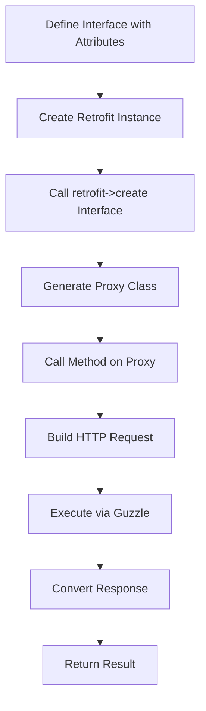
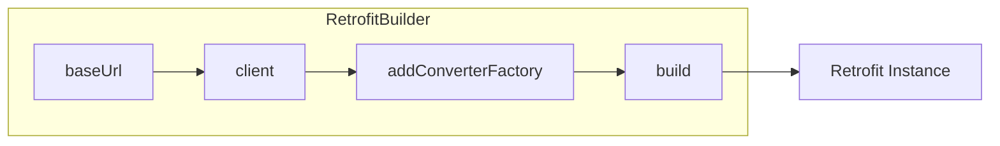
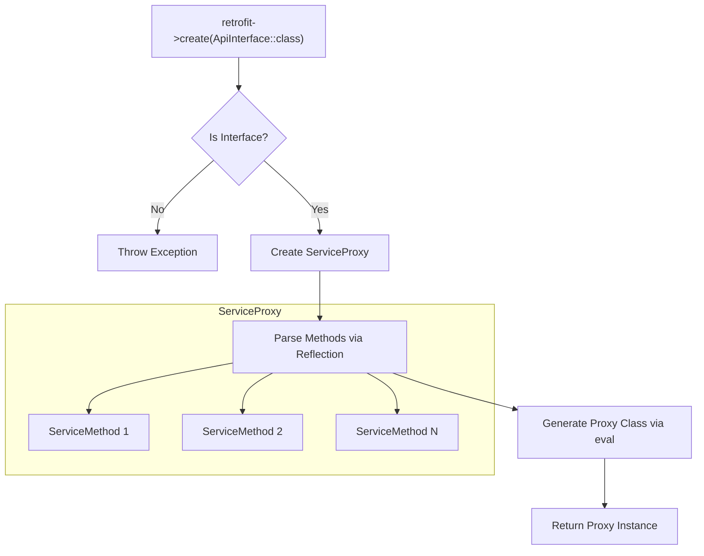
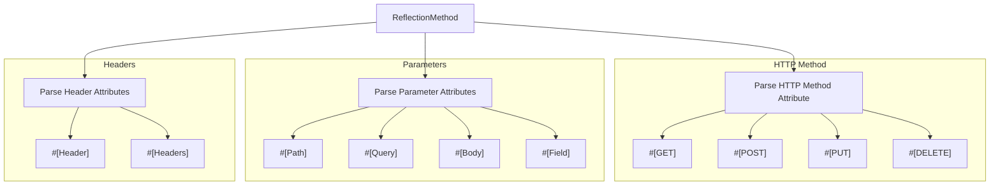
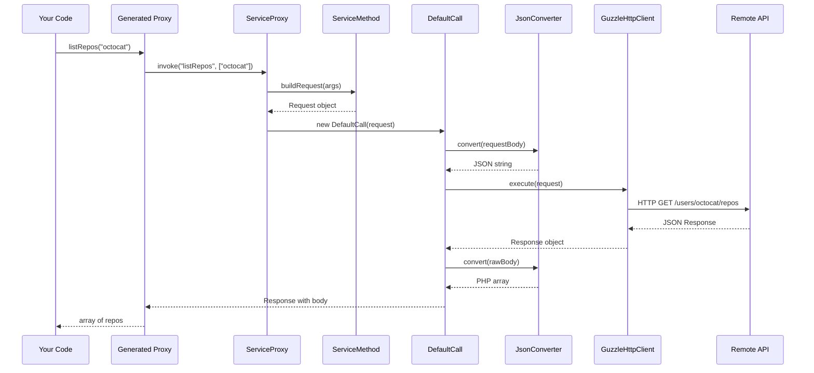
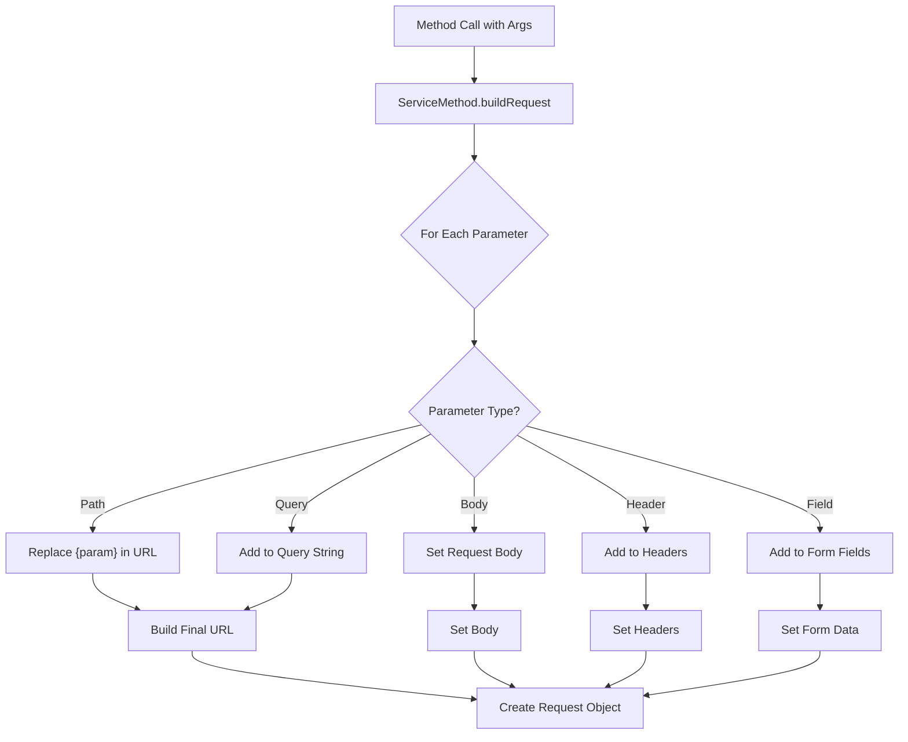
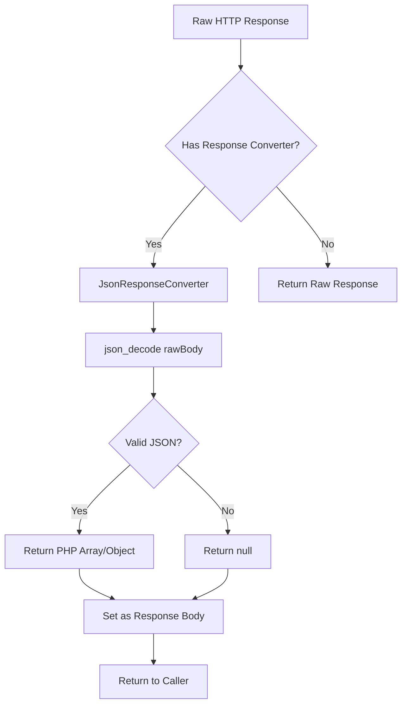
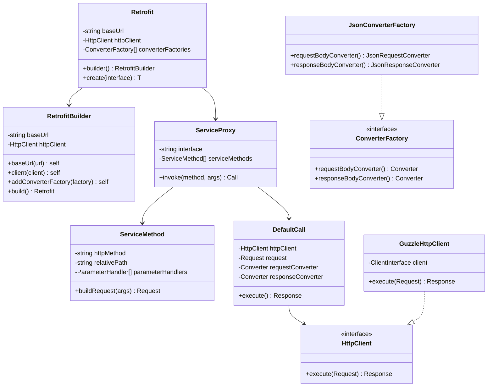
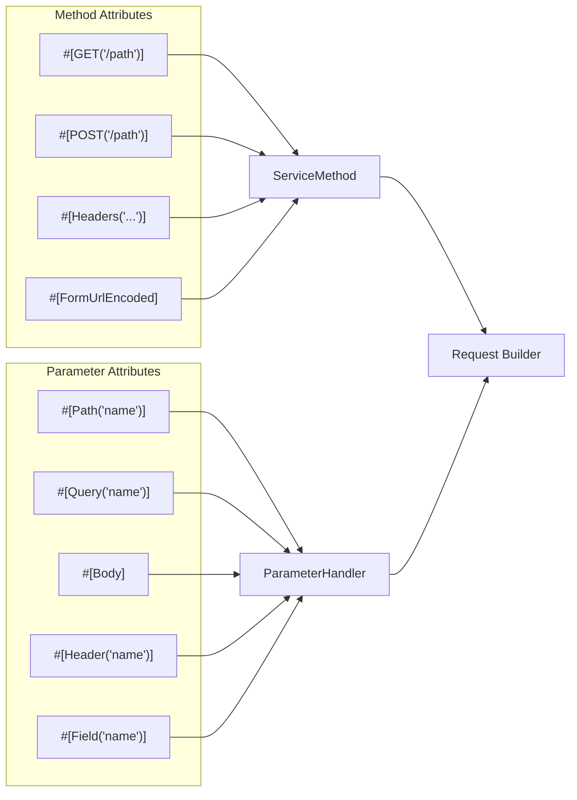

# Retrofit PHP - Architecture

## Overview

Retrofit PHP turns your interface definitions into HTTP API clients using PHP 8 attributes.

## High-Level Flow



## Detailed Component Flow

### 1. Setup Phase



### 2. Service Creation



### 3. Method Parsing



### 4. Request Execution



### 5. Request Building



### 6. Response Conversion



## Class Diagram



## Attribute Processing



## File Structure

```
src/
├── Retrofit.php                 # Main entry point
├── RetrofitBuilder.php          # Builder pattern
├── Attributes/
│   ├── Http/                    # HTTP method attributes
│   │   ├── GET.php
│   │   ├── POST.php
│   │   └── ...
│   ├── Parameter/               # Parameter attributes
│   │   ├── Path.php
│   │   ├── Query.php
│   │   ├── Body.php
│   │   └── ...
│   ├── Header.php
│   ├── Headers.php
│   └── FormUrlEncoded.php
├── Contracts/                   # Interfaces
│   ├── HttpClient.php
│   ├── Converter.php
│   ├── ConverterFactory.php
│   └── Call.php
├── Converter/                   # JSON converters
│   ├── JsonConverterFactory.php
│   ├── JsonRequestConverter.php
│   └── JsonResponseConverter.php
├── Http/                        # HTTP layer
│   ├── Request.php
│   ├── Response.php
│   └── GuzzleHttpClient.php
└── Internal/                    # Internal implementation
    ├── ServiceProxy.php
    ├── ServiceMethod.php
    ├── DefaultCall.php
    ├── ParameterHandler.php
    └── ParameterType.php
```
